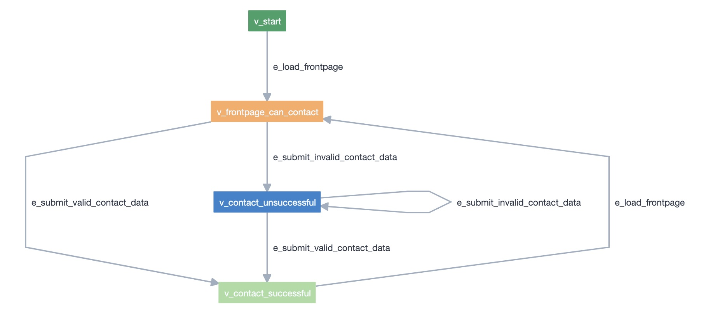

# Automated tests for Automation Week UI challenges from MoT

This repo provides test automation code for Automation Week UI challenges of Ministry of Testing 2020.
Different implementations and techniques are provided, showcasing how this could be achieved. Each has pros/cons that have to be considered.

Note: it's a learning exercise, so it may not be perfect. Nevertheless, I think it can be useful to get started.

## Overview of UI challenges

Next follows a description of the UI challenges for the sample website application [Restful Brooker Platform](https://automationintesting.online/) kindly provided by [Mark Winteringham](https://twitter.com/2bittester) / [Richard Bradshaw](https://twitter.com/FriendlyTester).


### 1. Beginner

_Create an automated test that completes the contact us form on the homepage, submits it, and asserts that the form was completed successfully._

### 2. Intermediate

_Create an automated test that reads a message on the admin side of the site._

_You’ll need to trigger a message in the first place, login as admin, open that specific message and validate its contents._

### 3. Advanced

_Create an automated test where a user successfully books a room from the homepage._

_You’ll have to click ‘Book this Room’, drag over dates you wish to book, complete the required information and submit the booking._

## Approach for implementing automated tests

In this repo, you'll find two different Python implementations for automated tests/checks based on the Page Objects Model (POM):

- one using pytest
- another using Model-Based Testing, using AltWalker and GraphWalker

### Model-based tests using AltWalker and GraphWalker

Using [Model Editor](https://altom.gitlab.io/altwalker/model-editor/) (or [GraphWalker Studio](https://graphwalker.github.io/)), we can model our application using a directed graph. In simple words, each vertex represents a state and each edge is a transition/action made in the application. Tests are made on the vertices/states.
Modeling is a challenge in itself and we can model the application and how we interact with it in different ways. Models are not exaustive; they're a focused perspective on a certain behavior that we want to understand.

For the first challenge (i.e. contact form submission), we start from a initial state, from where we just have one possible action/edge: load the frontpage.
Then we can consider another state, where the frontpage is loaded and the contact form is available.
Two additional states are possible: one for a successful contact and another for an unsuccessful contact submission. We can go to these states by either submiting valid or invalid contact data.
One curious thing comes out from the model: after a successful contact, we can only make a new contact if we load/refresh the frontpage again. Was this an expected behavior? Well, we would have to discuss with the team.



With GraphWalker Studio we can run the model in offline and see the paths (sequence of vertices and edges) performed.


One can make this model a bit more detailed and complex, by making explicit edges/transitions for the process of submiting one field as invalid. This makes the graph harder to read though and it will only be relevant if we want to distinguish those cases.


In order to validate if the contact/message appears correctly in the admin page (3rd challenge), we start from a vertex/state related to a sucessful contact. This vertex has a shared state with the first model shared earlier, which allows AltWalker/GraphWalker to jump from one to the other.

We can then go to the admin panel, authenticate if needed, go to the inbox/messages section, open and check the details of the last contact message.
We can see several edges corresponding to actions that can be done, allowing to transverse the graph and thus go to different application states.

Some edges (e.g. e_admin_correct_login) have "actions" defined in the model, to set an internal variable that can be useful later on.

Example:
```javacript
logged_in=true;
```

Some edges (e.g. e_click_admin_panel, from v_contact_successful to v_admin_login) have "guards", so they're only performed if those guard conditions are true.

Example:
```javacript
logged_in!=true
```

In this exercise, we take advantage of using model variables (e.g. last_contact_name, last_contact_subject) to temporarily store information about the last contact. The actual contact data used is implemented in code side and is populated on the model variables used for this purpose.


### Pre-requisites

- Python3
- Firefox (or other browser)
- GraphWalker v4.2.0 (v4.3.0 has some issues with AltWalker v0.2.7); see instructions [here](https://graphwalker.github.io/)

Install the python dependencies:

```pip install -r requirements.txt```

### Running automated tests

#### Standard tests using pytest

In order to run the standard pytest tests, just execute:
```pytest -s contact_form_pom_tests.py.py```

or, if you prefer using the helper bash script:

```./run_pytest.sh```

#### Model-based tests using AltWalker and GraphWalker

In order to run AltWalker tests (e.g. for the contact form), just execute the following commands.

```bash

altwalker check -m models/contact_form.json "random(vertex_coverage(100) and edge_coverage(100))"
altwalker verify -m models/contact_form.json tests
altwalker online tests -m models/contact_form.json "random(vertex_coverage(100) and edge_coverage(100))"
```


If you prefer, you may use the helper bash scripts:

```./run_altwalker_contact.sh```

```./run_altwalker_contact_detailed.sh```

```./run_altwalker_contact_with_message.sh```


## Final thoughts

On the app:

- app has some testability issues that inhibit usage of stable locators
- app has several bugs (intended or not :)) 

On the automated tests implementation:

- we can automate checks for the current behavior but we can't gurantee if that is the original intended one (e.g. phone format, fields size, flow behavior)
- randomization of data: control it, for reproduction purposes, using a seed
- Model-Based Testing:
  - beware with state management
  - not used to replace traditional tests (happy-path and negative tests)
  - can be harder to debug
  - models can connect with one another through shared states, which is useful

app has some testability issues that inhibit usage of stable locators

## References

- [AltWalker documentation](https://altom.gitlab.io/altwalker/altwalker/index.html)
- [Examples provided by AltWalker](https://altom.gitlab.io/altwalker/altwalker/examples.html)
- Python packages
  - [pypom](https://pypom.readthedocs.io/en/latest/)
  - [webdriver](https://pypi.org/project/selenium/)
  - [faker](https://faker.readthedocs.io/en/master/)

## Contact

You can find me on [Twitter](https://twitter.com/darktelecom).

## LICENSE

[MIT](LICENSE).